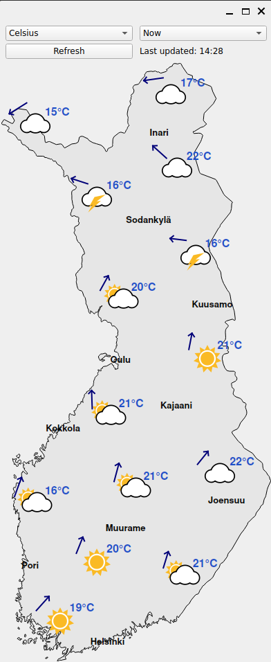
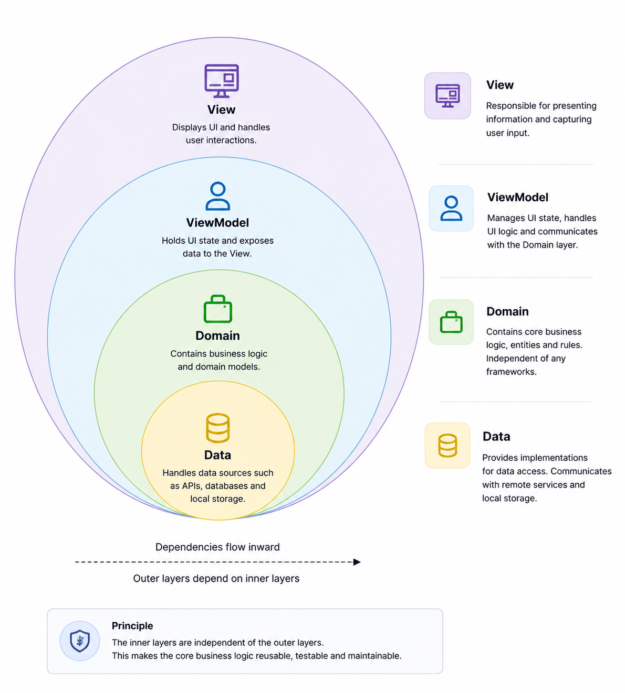

# WeatherMap

[](https://github.com/OssiTee/WeatherMap/actions/workflows/ci.yml)
[](https://github.com/OssiTee/WeatherMap/actions/workflows/cppcheck.yml)

WeatherMap is a Qt/C++ desktop application that visualizes Finnish weather data from the Finnish Meteorological Institute (FMI) on top of a rendered map of Finland.  
The application follows a clean, layered architecture (View → ViewModel → Domain ← Data) and includes a comprehensive test suite.

---

## Screenshot



---

## Features

- Map rendered from GeoJSON (`resources/map/fin.geojson`)
- City names and coordinates loaded from JSON (`resources/cities/cities.json`)
- Weather data fetched from FMI Open Data WFS (no API key required)
- FMI request template stored as a Qt resource for cleaner external API configuration
- Weather point coordinates stored as a Qt resource (`:/queries/weather_coords.txt`)
- Temperature unit selection (Celsius / Fahrenheit)
- Forecast horizon selection (current / future)
- Automatic weather refresh every 10 minutes
- Weather icons rendered from local SVG assets (FMI WeatherSymbol3)
- Structured logging with **spdlog**
- Clean MVVM architecture with strict separation of layers

---

## FMI Weather Data (No API Key Required)

WeatherMap uses the **FMI Open Data WFS API**, which is fully public and requires:

- no API key  
- no authentication  
- no registration  

---

## Map & Icon Data Sources

- Map geometry: Natural Earth public-domain data  
- Weather icons: FMI WeatherSymbol3 (MIT license)  
- Weather point coordinates configured through Qt resource `:/queries/weather_coords.txt`
- FMI request template and query resources under `resources/queries/`
- All assets are stored locally under `resources/`

---

## Project Structure

```text
WeatherMap/
│
├── include/        # Public headers for all layers
├── src/            # Implementation for domain, data, viewmodel, view
├── tests/          # Full test suite (QtTest), single test runner
├── resources/      # Map GeoJSON, city data, icons, FMI request template and weather coordinate resources
├── CMakeLists.txt  # Root CMake configuration
└── build_test_and_run.sh
```

## Architecture

This project follows an MVVM architecture combined with Clean architecture principles.




### **Domain Layer** (`include/domain/`)
Pure business logic, no Qt dependencies.

- `CityService`
- `WeatherService`
- `CoordinateNormalizer`
- `MapService`

### **Data Layer** (`include/data/`)
External data access and parsing.

- `CityLoader`
- `GeoJsonFileProvider`
- `WeatherRepository`
- `WeatherCache`
- `NetworkClient`
- `FmiXmlParser`

### **ViewModel Layer** (`include/viewmodel/`)
Presentation logic, Qt signals, async operations.

- `MapLoaderViewModel`
- `CityLabelsViewModel`
- `WeatherDataViewModel`

### **View Layer** (`include/view/`)
Qt Widgets UI.

- `MainWindow`
- `MapWidget`

### **Shared Layer** (`include/shared/`)
Utilities and common types.

- `Result<T>`
- `BoundingBox`
- `TemperatureUnit`
- `ForecastHorizon`
- `Logger` (spdlog)

---

## Requirements

- C++20
- Qt 6 (Widgets, Network, Concurrent, Svg)
- CMake ≥ 3.16

---

## Build and Run

### Standard build

```bash
mkdir -p build
cd build
cmake ..
cmake --build .
./bin/WeatherMap
```

### Using helper script

```bash
./build_test_and_run.sh
```

This script:
- Configures the build
- Builds all targets
- Runs the full test suite
- Launches WeatherMap

---

## Testing
WeatherMap includes a full test suite covering all layers of the application. Each test component is compiled into its own independent test executable.

### Test Structure

```text
tests/
├── data/
├── domain/
├── view/
└── viewmodel/
```

### Running tests manually

```bash
ctest --output-on-failure
```

---

## Logging

The application uses structured logging with spdlog:

- Initialization: Logger setup at application startup
- Service lifecycle: Service creation and initialization logs
- Map loading: Detailed progress of map data loading and processing
- Error handling: Clear error messages for debugging

Log output includes timestamps, log levels, and contextual information.
spdlog is licensed under the MIT License:
https://github.com/gabime/spdlog

---

## Static Code Analysis (cppcheck)

Static analysis is integrated into CI using cppcheck.

---

## Installing Dependencies on Ubuntu (22.04 / 24.04)

WeatherMap requires Qt 6, C++20 toolchain, and a few development libraries.

Install all required dependencies:

```bash
sudo apt update
sudo apt install -y \
    build-essential \
    cmake \
    ninja-build \
    g++ \
    qt6-base-dev \
    qt6-base-dev-tools \
    qt6-tools-dev \
    qt6-tools-dev-tools \
    qt6-svg-dev \
    qt6-networkauth-dev \
    qt6-declarative-dev \
    libcurl4-openssl-dev \
    pkg-config \
    libspdlog-dev
```
---

## Future Plans

### Cloud Coverage Visualization

An upcoming planned feature is the ability to display cloud coverage areas on the weather map. The goal is to incorporate cloud cover data from FMI and visualize it as shaded or contoured regions on the map, similar to how other weather layers are rendered. This would provide a clearer overview of large‑scale cloud patterns and improve the overall usefulness of the weather visualization.

---